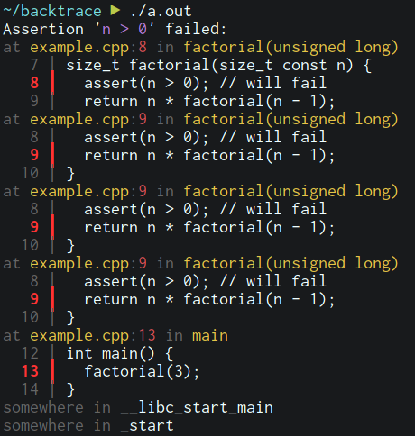

# nice_backtrace

Instead of this:
```sh
$ ./a.out
a.out: example.cpp:10: <some loooong symbol>: Assertion `n > 0' failed.
[1]    1953 abort (core dumped)  ./a.out

$ coredumpctl debug 1953
(gdb) where
<stacktrace>
```
Do this:



## How

Just include `#include "backtrace.hpp"` both **before** and **after** all other
includes:

```c++
// before all else
#include "backtrace.hpp"

// now include all other stuff you need here
#include <vector>
// ...

// and include backtrace.hpp again (cassert has no include guard and will
// overwrite the assert macro every time, here we restore it)
#include "backtrace.hpp"

size_t factorial(size_t const n) {
  assert(n > 0); // will fail
  return n * factorial(n - 1);
}

int main() {
  factorial(3);
}
```

Then when compiling, be sure to generate debug symbols and link the GNU `dl` library:
```shell
$ g++ -g -ldl example.cpp
```

This requires **glibc** (>= 2.1) and GNU binutils on a POSIX system like linux,
BSD, or MacOS. It will not work on Windows.

The second include is required because `#include <cassert>` has no include guard
and will always overwrite the assert macro. If you want a less brittle
stack-traced assertion, you can define your own macro:
```c++
#define my_assert(cond) backtrace_assert((cond), #cond)
```
and use that instead of `assert`.

## How it works

Glibc comes with a builtin `backtrace()` function that reads the return
addresses from the stack. Together with `dladdr`, these are converted to
physical offsets in the ELF text segment of the respective shared library or
executable. `addr2line` converts these into demangled symbols and source file
positions, if available.

The remaining threehundredsomething lines make it look pretty.

## Similar Libraries

`backtrace.hpp` is designed to have only highly-available and stable
dependencies. It should work on any linux machine (which empirically always ship
with glibc) with no additional requirements. There are some similar efforts in
terms of functionality, but may require more configuration to set up:

- [Boost.Stacktrace](https://www.boost.org/doc/libs/1_65_1/doc/html/stacktrace.html),
  a header-only library that supports different backends for stacktrace
  generation, including the glibc+addr2line combination used in nice_backtrace.
- [backward-cpp](https://github.com/bombela/backward-cpp), a more complex
  machinary that sets up a signal handler to intercept crashes, hence also
  providing backtraces on segfaults etc. Not header-only, supports multiple
  backends, including libgcc or a clang equivalent, which requires no additional
  installation.

I wrote nice_backtrace because I wasn't aware of these libraries at the time,
but still think that it provides a nice drop-in solution with very little setup
overhead.
